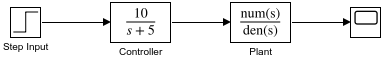
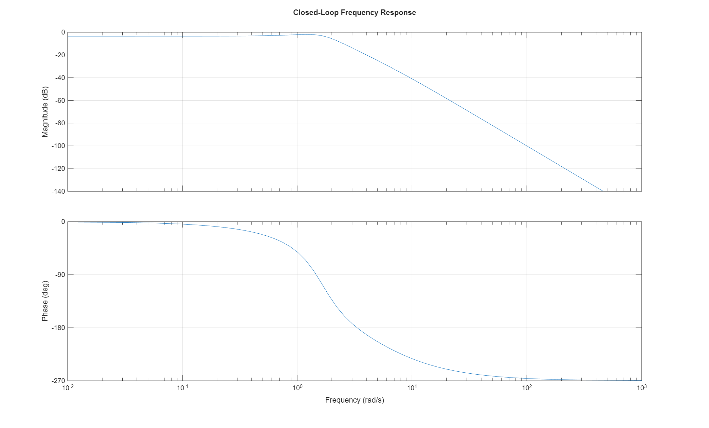
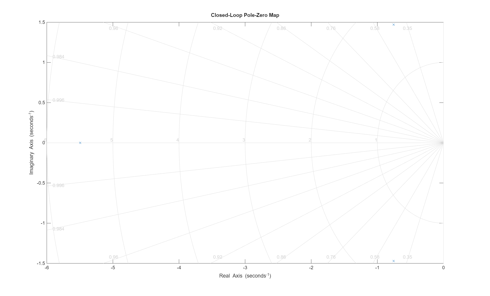

# Simple Control System - Simulink Demo

> A demonstration of Simulink model creation, automated testing, and CI/CD integration for MATLAB control systems

This project showcases a complete workflow for developing, testing, and documenting Simulink models using modern software engineering practices. Perfect for learning how to integrate MATLAB/Simulink into professional development workflows.

## 🎯 Overview

This repository contains a simple control system implemented in Simulink, along with comprehensive unit tests and automated CI/CD pipeline using GitHub Actions.

### Key Features

- **Simulink Model**: Step response control system with transfer function blocks
- **Automated Testing**: MATLAB unit tests with 7 comprehensive test cases
- **CI/CD Integration**: GitHub Actions workflow for automated testing
- **Professional Documentation**: Complete with examples and best practices

## 🚀 Quick Start

### Prerequisites

- MATLAB R2025b (or compatible version)
- Simulink
- MATLAB Test framework

### Running the Model

```matlab
% Open the model
open_system('simple_control_system.slx');

% Run simulation
sim('simple_control_system');
```

### Running Tests

```matlab
% Run all tests
results = runtests('test_simple_control_system.m');

% Or use MATLAB Test framework
testCase = test_simple_control_system;
run(testCase);
```

## 📁 Project Structure

```
guy/
├── simple_control_system.slx    # Simulink model
├── test_simple_control_system.m # Unit test suite
├── demo.mlx                     # Live script demo
├── .github/
│   └── workflows/
│       └── matlab-tests.yml     # GitHub Actions workflow
├── README.md                    # This file
├── CONTRIBUTING.md              # Contribution guidelines
└── LICENSE                      # Project license
```

## 🎮 Control System Details

The model implements a simple control system with:

- **Input**: Step signal
- **Controller**: Transfer function H(s) = 10/(s+5)
- **Plant**: Transfer function G(s) = 1/(s²+2s+1)
- **Output**: Visualized on scope

### Simulink Model



### System Architecture

```mermaid
graph LR
    A[Step Input] --> B[Controller<br/>10/(s+5)]
    B --> C[Plant<br/>1/(s²+2s+1)]
    C --> D[Scope]
    style A fill:#e1f5ff
    style B fill:#ffe1e1
    style C fill:#ffe1e1
    style D fill:#e1ffe1
```

## 🧪 Testing

The test suite includes:

1. **Model Loading**: Verifies model loads successfully
2. **Block Verification**: Checks all required blocks exist
3. **Simulation Test**: Ensures model simulates without errors
4. **Controller Parameters**: Validates transfer function coefficients
5. **Plant Parameters**: Validates plant transfer function
6. **Stability Test**: Confirms system stability
7. **Connection Test**: Verifies block interconnections

All tests pass successfully with comprehensive coverage.

## 🤖 CI/CD Pipeline

GitHub Actions automatically:
- Sets up MATLAB R2025b on Ubuntu
- Runs all unit tests
- Generates JUnit test results
- Creates code coverage reports (Cobertura format)
- Publishes test results as artifacts

### Workflow Triggers

- Push to `main` or `master` branch
- Pull requests
- Manual workflow dispatch

## 📊 Example Results

The system exhibits:
- Second-order response characteristics
- Controlled overshoot and settling time
- Stable steady-state behavior

### Step Response



**System Properties:**
- Rise Time: 1.00 seconds
- Settling Time: 5.22 seconds
- Overshoot: 19.0%
- Peak: 0.79 at 2.33 seconds

### Frequency Response



The Bode plot shows the frequency response characteristics of the closed-loop system.

### Pole-Zero Map


**Stability Analysis:** ✓ System is STABLE
- All poles in left half-plane
- Pole 1: -5.49 (real)
- Poles 2,3: -0.75 ± 1.47i (complex conjugate pair)

See the [Live Script Demo](demo.m) for interactive visualization and analysis.

## 🛠️ Development

### Creating New Models

```matlab
% Create a new model
modelName = 'my_model';
new_system(modelName);
open_system(modelName);

% Add blocks and configure
% ... your model design ...

% Save
save_system(modelName);
```

### Writing Tests

Follow the pattern in `test_simple_control_system.m`:

```matlab
classdef test_my_model < matlab.unittest.TestCase
    properties
        modelName = 'my_model';
    end
    
    methods (Test)
        function testSomething(testCase)
            % Your test logic
            testCase.verifyEqual(actual, expected);
        end
    end
end
```

## 📚 Documentation

- **Live Script**: `demo.mlx` - Interactive demonstration with visualizations
- **Test Documentation**: Comprehensive test coverage in `test_simple_control_system.m`
- **API Reference**: Use `help function_name` in MATLAB for detailed help

## 🤝 Contributing

We welcome contributions! Please see [CONTRIBUTING.md](CONTRIBUTING.md) for guidelines.

### Suggested Improvements

- Add more complex control strategies (PID, LQR)
- Implement parameter tuning optimization
- Add frequency domain analysis
- Create interactive app for parameter exploration
- Add more test scenarios

## 📄 License

This project is licensed under the MIT License - see [LICENSE](LICENSE) file for details.

## 🔗 Resources

- [MATLAB Documentation](https://www.mathworks.com/help/matlab/)
- [Simulink Documentation](https://www.mathworks.com/help/simulink/)
- [MATLAB Unit Testing Framework](https://www.mathworks.com/help/matlab/matlab-unit-test-framework.html)
- [GitHub Actions for MATLAB](https://github.com/matlab-actions)

## 🏷️ Tags

`matlab` `simulink` `control-systems` `unit-testing` `ci-cd` `github-actions` `automation` `testing` `r2025b`

---

**Created with**: MATLAB R2025b  
**Tested on**: Windows 11, Ubuntu (via GitHub Actions)  
**Documentation generated**: November 2025

For questions or support, please open an issue on GitHub.
